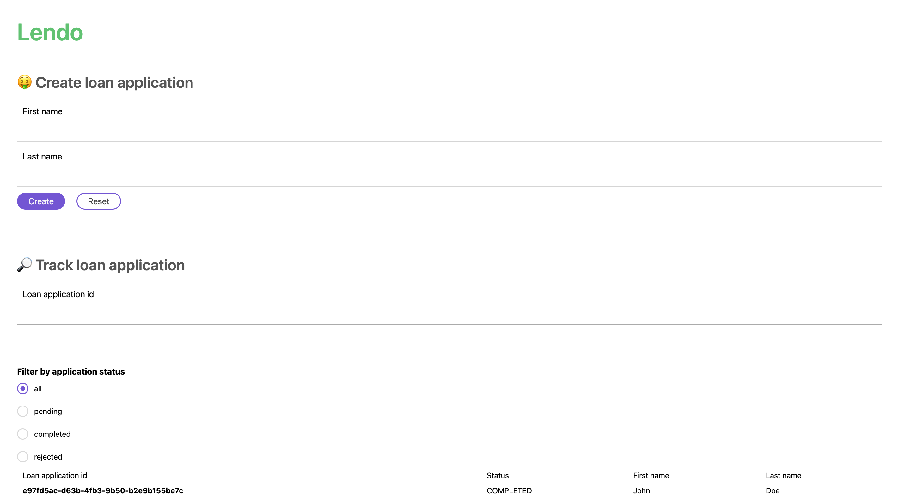

This is a [Next.js](https://nextjs.org/) project bootstrapped with [`create-next-app`](https://github.com/vercel/next.js/tree/canary/packages/create-next-app).

## Getting Started

First, run the development server:

```bash
npm install
npm run dev
# or
yarn install
yarn dev
```

Open [http://localhost:3000](http://localhost:3000) with your browser to see the result.



## Production version deployed at

https://lendo-web.vercel.app

## Run this NextJS app with Docker

- Download the Lendo web app from:
  docker pull lendo-web-app:latest
- Run the Lendo web app service:
  docker run -p 3000:3000 lendo-web-app:latest
- Once you have the Lendo web app container up and running you can access from http://localhost:3000
  or if you are running docker for windows from http://<docker-machine-ip>:3000
